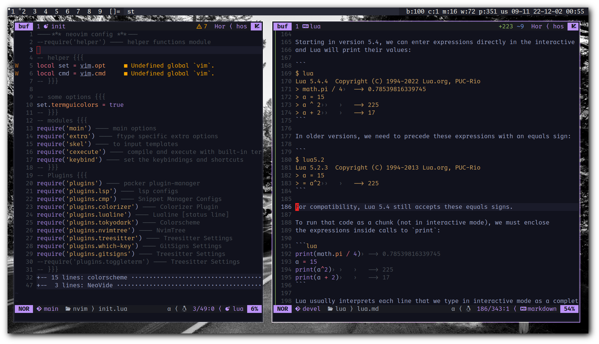

# nvim

Hos's neovim config

Alright! Finally that day have came and I rewrote my `nvim` config with `lua`
:)

I've created some modules for specific type of works, and I did my best to
write them as modular as possible.

## Dependencies

+ Plugin Manager: [packer](wbthomason/packer.nvim)
+ Plugins:
    + LSP: [nvim-lspconfig](neovim/nvim-lspconfig)
    + Snippets: [LuaSnip](L3MON4D3/LuaSnip)
        + [nvim-cmp](hrsh7th/nvim-cmp)
            + [cmp-nvim-lsp](hrsh7th/cmp-nvim-lsp)
            + [cmp-nvim-lua](hrsh7th/cmp-nvim-lua)
            + [cmp-buffer](hrsh7th/cmp-buffer)
            + [cmp-path](hrsh7th/cmp-path)
    + Go to definition: [nvim-gtd](hrsh7th/nvim-gtd)
    + Statusline: [lualine.nvim]()
    + Tree: [nvim-tree.lua]()
    + Programming Symbols: [symbols-outline.nvim]()
    + More colors and diagnosis: [nvim-treesitter]()
    + Render Hex colors: [nvim-cololizer.lua]()
    + Greetings: [alpha-nvim]()
    + Git: [gitsigns.nvim]()
    + Show keymaps: [which-key.nvim]()
    + Icons: [nvim-web-devicons]()
    + Fuzzy finder tools: [telescope.nvim]()
        + [plenary.nvim]()
        + [lazygit.nvim]()
        + [ripgrep](BurntSushi/ripgrep)
        + [fd](sharkdp/fd)
+ Colorschemes:
    + [ayu](Shatur/neovim-ayu)
    + [dracula](Mofiqul/dracula.nvim)
    + [tokyodark](tiagovla/tokyodark.nvim)
    + [256noir](hossein-lap/vim-256noir)
    + [sunbather](hossein-lap/vim-sunbather)
    + [paramount](hossein-lap/vim-paramount)
    + [lupper](hossein-lap/vim-lupper)
    + [octave](hossein-lap/vim-octave)
+ LSPs:
    + C/C++: `clangd`
    + Python: `pyright`
        + `nodejs`, `npm` or `yarn`
        + Install both python and js modules
    + Bash: `bash-language-server`
        + Note: it's disabled right now, but the config exists
        + `nodejs`, `npm` or `yarn`
        + Install js module
    + Lua: `lua_ls` (`lua-language-server`)
    + LaTeX: `texlab`
    + Go: `gopls`
+ `xclip`
+ `lazygit`
    + 

## Modules

#### Keep that in mind

This module have to be the **first** module you call, because others have
dependencies on this one.

### Main

This module sets very basic configuration for `nvim`.

Things like:

- Line numbering
- Wrap lines
- Highlight current line
- Set spell check language(s)
- etc...

### Keybind

Contains keybindings for:

- Add/Remove comment [`-`, `+`]
- Compile/Execute programs [`<leader>fw`, `<leader>fe`]
- Enable/Disable **paste** mode [`<C-p>`]
- Enable/Disable **spell check** [`<leader>ss`]
- etc...

### Extra

It adds some extra features like:

- Insert actual <tab> instead of spaces on
    some specific filetypes.
- Make sure to insert spaces instead of <tab>
    on some space-sensitive languages.
- A function to toggle auto-fill `' " { [ (` chars
    and enable the auto-fill for some filetypes.
    - Also auto-fill `_` and `*` for `makrdown` and `rmarkdown` files.

### Skel

If you want to set the leader key [or anything] to `,`
note that I have `,` set to **read some template files located in
`$HOME/.config/nvim/templates/` directory to the current file**.

### cp

#### Screenshot

#### ToDo

- [x] Run and Compile
- [x] Auto Complete `( { [ " '`
- [x] Write every custom plugins modular
- [ ] Complete the `README.md` file (in progress)

